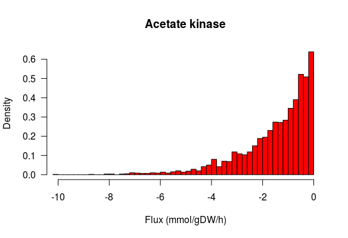

**VolEsti** is a `C++` library for volume approximation and sampling of convex bodies (*e.g.* polytopes) with an `R` and limited `python` interface. **VolEsti** is part of the [GeomScale](https://geomscale.github.io) project.

This is a development branch that contains the supplementary code of the manuscript "Geometric algorithms for sampling the flux space of metabolic networks".  

Authors: Apostolos Chalkis, Vissarion Fisikopoulos, Elias Tsigaridas, Haris Zafeiropoulos.

###  Dependencies

To run the code you need R 3.6.3 and you have to install the following R packages:  

1. `volesti` dependencies (see the DESCRIPTION file in folder `root/R-proj`)  
2. `Rmosek` (a) [mosek installation guide](https://docs.mosek.com/9.2/install/installation.html) and (b) [Rmosek installation guide](https://docs.mosek.com/9.2/rmosek/install-interface.html)  
3. `pracma`
4. `Matrix`
5. `R.matlab`

###  Installation

To install volesti of the current branch, in folder `/root/R-proj` run:  
```r
Rcpp::compileAttributes()  
devtools::install()  
library(volesti)  
```

### Sample steady states

First you have to download the mat file of the model you wish to sample from [Bigg](http://bigg.ucsd.edu/models) or the Recon2D_v04, Recon_d_301 from [VMH](https://www.vmh.life/) and save it to the folder `root/R-proj/metabolic_mat_files`.  

Then follow the script `root/R-proj/example.R`. In that script we sample from the simplest model of the Escherichia Coli (the mat file is already saved in `root/R-proj/metabolic_mat_files`).  

If you execute it you shall get the following histogram that approximates the flux distribution of the reaction `Acetate kinase`.  


